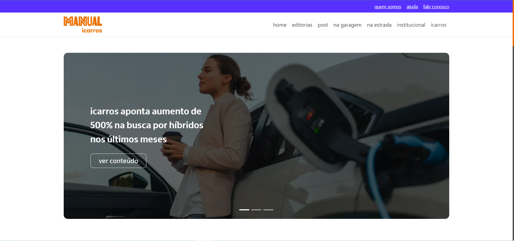

<!-- TITLE -->
<h1 align="center" color="black"><a href="https://www.icarros.com.br/manual-icarros" target="_blank">Icarros</a></h1>

<!-- THUMB -->

  

<!-- STATUS -->

---

<!-- DESCRIPTION -->

 
        💡 
        Projeto consiste em uma iniciativa interna desenvolvida para atender a um cliente específico. Durante o processo, utilizei o layout original para fins de estudo e realizei uma adaptação para SvelteKit.
    

<!-- INTRO -->

## Índice

- [Tecnologias](#tecnologies)
- [Objetivo](#goal)
- [Funcionalidades](#features)
- [Requerimentos de qualidade](#quality)
- [Instruções de Uso](#glossary)
- [Autor](#authors)

## Tecnologias 

- Sveltekit
- Typescript
- Sass
- AOS (Animações)

## Objetivo 

O objetivo deste projeto é um estudo do framework SvelteKit. Desenvolvi uma plataforma atraente para explorar suas funcionalidades e recursos.

## Requerimentos de qualidade 

- Responsividade
- Performance

## Instruções de Uso 

- Certifique-se de ter o Node.js instalado em seu sistema. Em seguida, execute o seguinte comando para instalar as dependências do projeto:

`npm install`

 

- Para iniciar o servidor de desenvolvimento local, utilize o seguinte comando:

`npm run dev`

O sistema estará disponível em http://localhost:5000/. As alterações no código serão recarregadas automaticamente no navegador durante o desenvolvimento.

 

- Para criar a versão final do projeto otimizada para produção, execute o seguinte comando:

`npm run build`

Os arquivos finais serão gerados na pasta 'build'.

 

- Após o processo de build, visualize a versão de produção localmente com o seguinte comando:

`npm run preview`

O sistema estará disponível em http://localhost:5000/ em uma versão otimizada para produção.

 

- O projeto utiliza ESLint para análise estática do código e Prettier para formatação. Verifique problemas de linting ou formate o código automaticamente com os seguintes comandos:

`npm run lint`

`npm run format `

## Autor 

- [@Gabriel Assunção](https://github.com/zDeep10) - Ideia e Construção
  f
